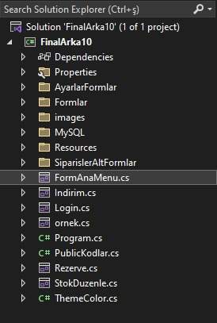
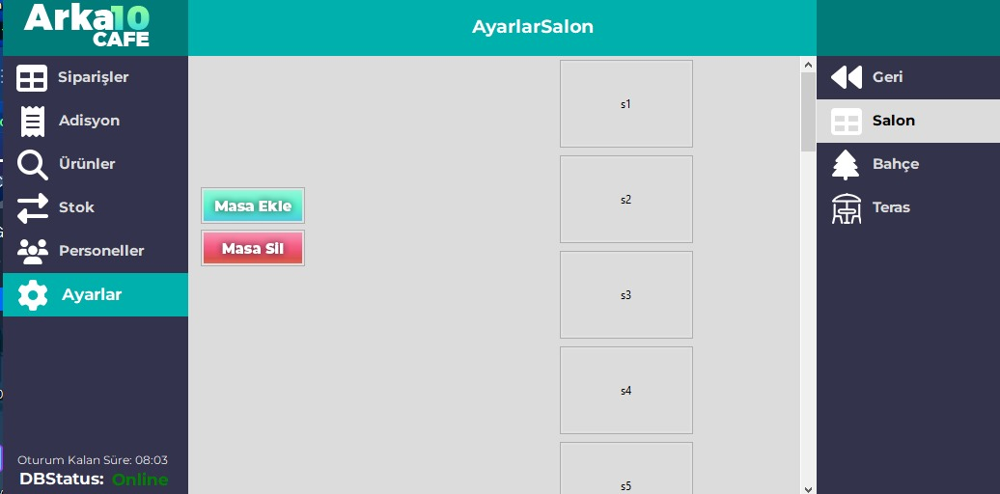
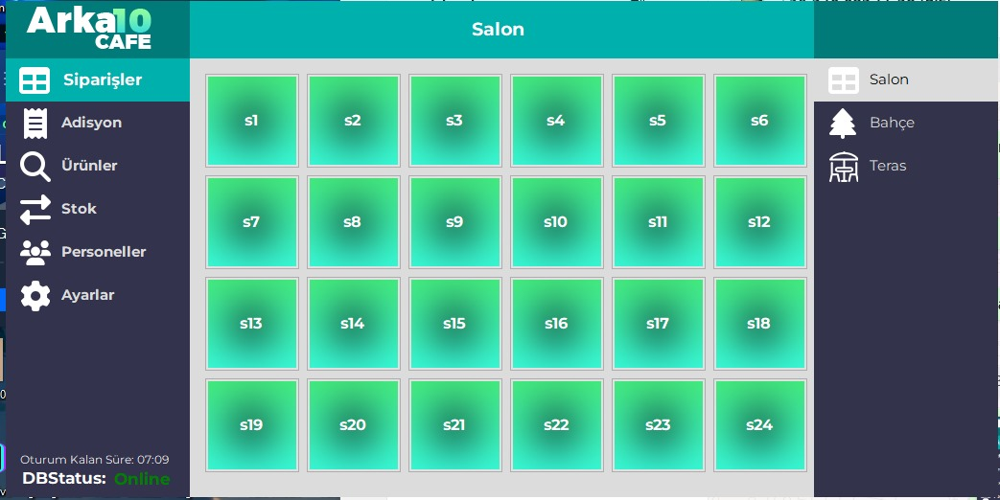
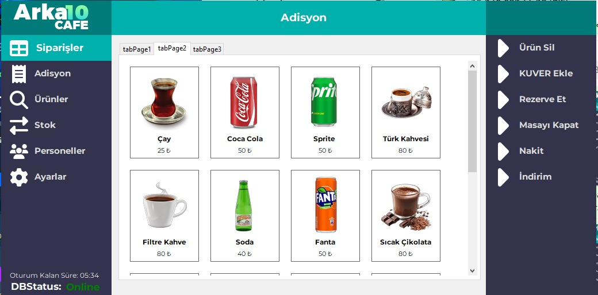
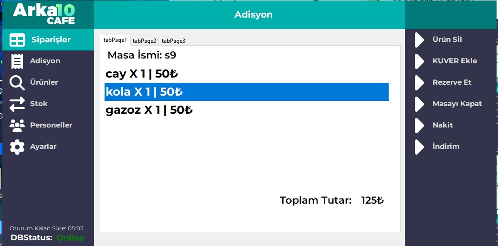
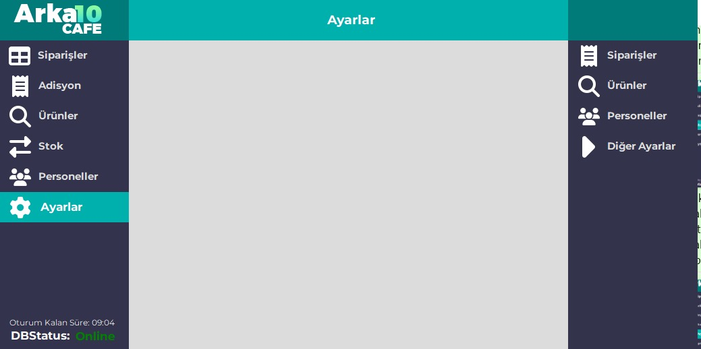
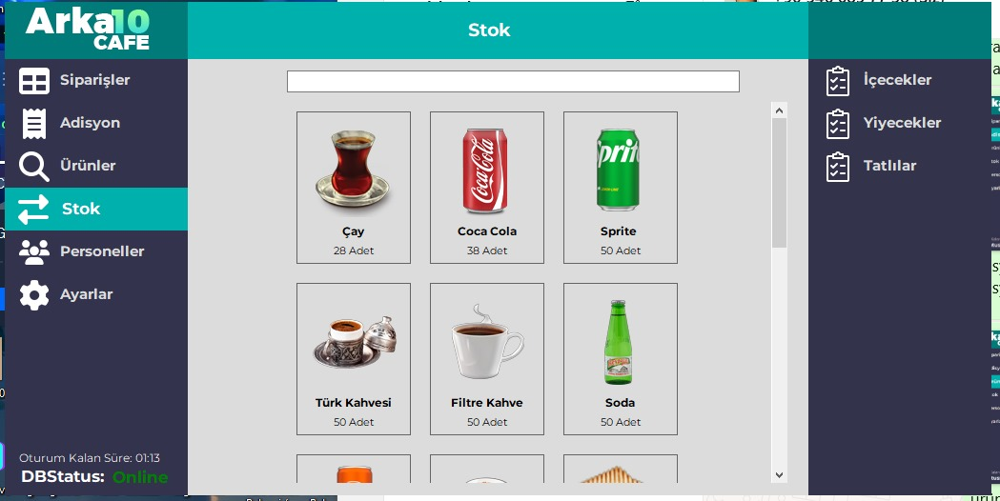
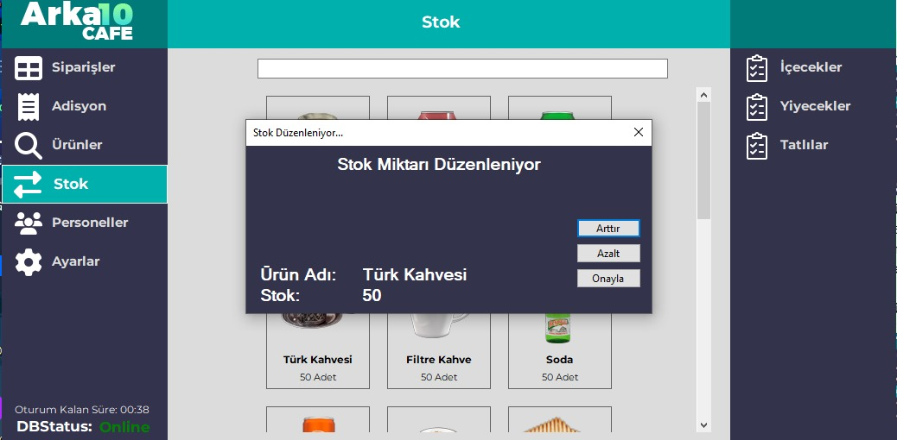
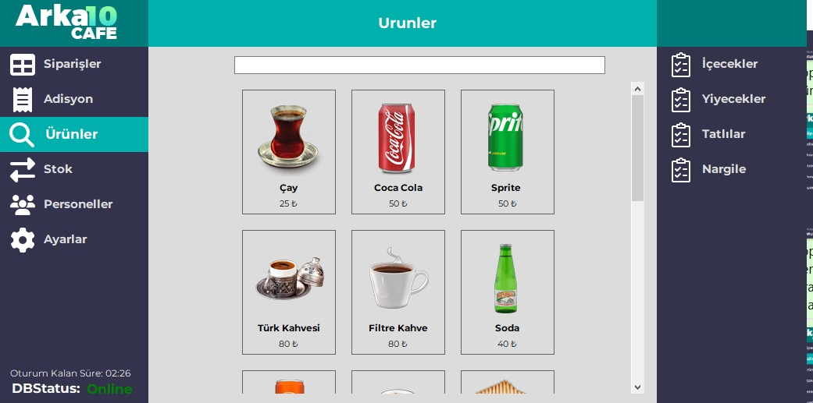
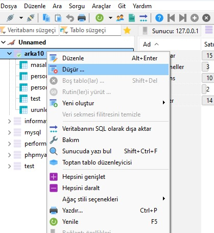

# FinalArka10 - Restoran Yönetim Sistemi

[](https://dotnet.microsoft.com/)
[](https://www.mysql.com/)
[](https://docs.microsoft.com/en-us/dotnet/csharp/)

> Modern, kullanıcı dostu restoran/cafe yönetim sistemi

## 📋 Proje Açıklaması

FinalArka10, modern bir restoran/cafe yönetim sistemi olarak geliştirilmiş kapsamlı bir Windows Forms uygulamasıdır. C# programlama dili ile yazılıp, MySQL veritabanı kullanarak sipariş yönetimi, masa rezervasyonu, ürün stok takibi, personel yönetimi ve raporlama gibi temel restoran operasyonlarını destekler.

Bu sistem, restoran işletmecilerinin günlük operasyonlarını kolaylaştırmak, müşteri memnuniyetini artırmak ve işletme verimliliğini optimize etmek amacıyla tasarlanmıştır.

## 📸 Ekran Görüntüleri


### Form Ana Menu


### Masa Ekleme


### Masalar Ekrani


### Personel Ekleme


### Adisyon Ekrani


### Adisyon Icerik


### Ayarlar


### Stok Ekrani


### Stok Duzenleme


### Urunler Ekrani


### Sql Kurulum



## 🚀 Hızlı Başlangıç

```bash
# Repository'yi klonlayın
git clone https://github.com/MrCaar/arka10-cafe
cd arka10-cafe

# Paketleri yükleyin
dotnet restore

# Uygulamayı çalıştırın
dotnet run
```

## ✨ Özellikler

### 🍽️ Sipariş Yönetimi
- ✅ **Masa Bazlı Sipariş**: Salon, bahçe ve teras olmak üzere üç farklı alanda masa yönetimi
- ✅ **Gerçek Zamanlı Sipariş Takibi**: Siparişlerin durumu ve içeriği anlık olarak takip edilebilir
- ✅ **Sipariş Geçmişi**: Tüm siparişler loglanır ve raporlanabilir
- ✅ **Rezervasyon Sistemi**: Masa rezervasyonları zaman bazlı yönetilir
- ✅ **İndirim Uygulama**: Yüzde bazlı indirim sistemi (Indirim.cs)
- ✅ **Çoklu Ödeme Yöntemi**: Nakit ödeme desteği (Nakit.cs)

### 📊 Ürün Yönetimi
- ✅ **Kategorize Ürünler**: İçecekler, yiyecekler ve tatlılar olmak üzere üç ana kategori
- ✅ **Stok Takibi**: Her ürünün stok miktarı gerçek zamanlı olarak takip edilir
- ✅ **Fiyat Yönetimi**: Ürün fiyatları kolayca güncellenebilir
- ✅ **Resim Desteği**: Ürünler için görsel destek (PNG formatında)
- ✅ **Ürün Düzenleme**: Mevcut ürünleri düzenleme ve güncelleme (UrunDuzenle.cs)

### 👥 Personel Yönetimi
- ✅ **Personel Bilgi Yönetimi**: Ad, soyad, telefon, adres gibi temel bilgiler
- ✅ **Pozisyon Tanımlama**: Garson, yönetici gibi pozisyonlar
- ✅ **Not Sistemi**: Personel hakkında özel notlar eklenebilir

### 🏗️ Sistem Yönetimi
- ✅ **Güvenli Giriş**: Sayısal tuş takımı ile şifre korumalı giriş
- ✅ **Oturum Yönetimi**: 1 saatlik oturum süresi ile güvenlik
- ✅ **Veritabanı Bağlantı Kontrolü**: Sistem durumu sürekli izlenir
- ✅ **Tema Desteği**: Dinamik renk temaları (ThemeColor.cs)
- ✅ **Masa Ayarları**: Masa ekleme/silme, kategori yönetimi

## 🏗️ Sistem Mimarisi

### Teknoloji Stack
- **Programlama Dili**: C# (.NET 8.0)
- **UI Framework**: Windows Forms
- **Veritabanı**: MySQL 8.0+
- **Paket Yönetimi**: NuGet
- **JSON İşleme**: Newtonsoft.Json
- **Görüntü İşleme**: System.Drawing

### Proje Yapısı
```
FinalArka10/
├── MySQL/                    # Veritabanı bağlantı sınıfı
│   └── MySQL.cs             # DatabaseHelper sınıfı
├── Formlar/                  # Ana uygulama formları
│   ├── Siparisler.cs        # Sipariş yönetimi ana formu
│   ├── Urunler.cs           # Ürün listesi ve yönetimi
│   ├── Stok.cs              # Stok durumu görüntüleme
│   ├── Personeller.cs       # Personel listesi ve detayları
│   ├── Ayarlar.cs           # Sistem ayarları ana menüsü
│   ├── IkinciForm.cs        # Ana sipariş işlemi formu (766 satır)
│   └── ...
├── SiparislerAltFormlar/     # Sipariş alt formları
│   ├── Bahce.cs             # Bahçe masa yönetimi
│   ├── Salon.cs             # Salon masa yönetimi
│   └── Teras.cs             # Teras masa yönetimi
├── AyarlarFormlar/           # Ayarlar alt formları
│   ├── AyarlarMasalar/      # Masa ayarları
│   │   └── AyarlarMasalarMainMenu.cs
│   ├── AyarlarUrunler/      # Ürün ayarları
│   └── AyarlarPersoneller/  # Personel ayarları
├── Özel Formlar/
│   ├── UrunDuzenle.cs       # Ürün düzenleme formu
│   ├── StokDuzenle.cs       # Stok düzenleme formu
│   ├── Indirim.cs           # İndirim uygulama formu
│   ├── Nakit.cs             # Nakit ödeme formu
│   ├── Rezerve.cs           # Masa rezervasyonu formu
│   └── ThemeColor.cs        # Tema renk yönetimi
├── images/                   # Ürün resim dosyaları
├── Properties/               # Uygulama özellikleri
└── Resources/                # Sistem kaynakları (ikonlar)
```

## 🗄️ Veritabanı Yapısı

### Tablolar

#### `masalar` Tablosu
```sql
CREATE TABLE masalar (
  masakategori VARCHAR(50),    -- 'salon', 'bahce', 'teras'
  masaid VARCHAR(50),          -- Benzersiz masa ID (örn: s1, b2, t3)
  masaozet VARCHAR(250),       -- JSON formatında sipariş özeti
  rezerve_time INT(11),        -- Rezervasyon başlangıç zamanı (timestamp)
  rezerve_end_time INT(11),    -- Rezervasyon bitiş zamanı (timestamp)
  masadurum VARCHAR(50)        -- 'bos', 'dolu', 'pasif'
);
```

#### `urunler` Tablosu
```sql
CREATE TABLE urunler (
  kategori VARCHAR(255),       -- 'icecekler', 'yiyecekler', 'tatlilar'
  urunid VARCHAR(50),          -- Benzersiz ürün ID
  urunadi VARCHAR(255),        -- Ürün adı
  fiyat INT(11),               -- Ürün fiyatı (kuruş cinsinden)
  urunimage VARCHAR(255),      -- Ürün resim dosyası yolu
  stok INT(11) DEFAULT 0       -- Stok miktarı
);
```

#### `personeller` Tablosu
```sql
CREATE TABLE personeller (
  id INT(11) PRIMARY KEY AUTO_INCREMENT,
  ad TEXT,                     -- Personel adı
  soyad TEXT,                  -- Personel soyadı
  dtarihi TEXT,                -- Doğum tarihi
  adres TEXT,                  -- Adres
  telefon TEXT,                -- Telefon numarası
  notlar TEXT DEFAULT '',      -- Özel notlar
  pozisyon VARCHAR(50) DEFAULT 'Garson'
);
```

#### `siparisler_log` Tablosu
```sql
CREATE TABLE siparisler_log (
  siparis_id VARCHAR(50),      -- Benzersiz sipariş ID
  icerik LONGTEXT,             -- JSON formatında sipariş içeriği
  kapanis_tarihi TIMESTAMP     -- Sipariş kapanış tarihi
);
```

## 📦 Kurulum ve Çalıştırma

### Ön Gereksinimler
- **İşletim Sistemi**: Windows 10/11 (Linux'ta GUI sınırlamaları olabilir)
- **.NET Framework**: .NET 8.0 SDK
- **Veritabanı**: MySQL Server 8.0+
- **Geliştirme Ortamı**: Visual Studio 2022 veya VS Code

### Adım Adım Kurulum

#### 1. Depoyu Klonlayın
```bash
git clone <https://github.com/MrCaar/arka10-cafe>
cd arka10-cafe
```

#### 2. .NET Paketlerini Yükleyin
```bash
dotnet restore
```

#### 3. Veritabanını Kurun
```bash
# MySQL'e bağlanın ve veritabanını oluşturun
mysql -u root -p
```

```sql
-- Veritabanını oluşturun
CREATE DATABASE arka10;
-- SQL dosyasını import edin
source arka10.sql;
```

#### 4. Resim Dosyalarını Yerleştirin
Ürün resimlerini `images/` klasörüne yerleştirin:
- cay.png
- kola.png
- gazoz.png
- vb.

#### 5. Uygulamayı Çalıştırın
```bash
dotnet run
```

### Alternatif: Visual Studio ile Çalıştırma
1. `FinalArka10.sln` dosyasını Visual Studio'da açın
2. NuGet paketlerini geri yükleyin
3. F5 ile çalıştırın

## 🔧 Yapılandırma

### Giriş Sistemi
- Varsayılan şifre: `Password`
- Değiştirmek için `Login.cs` dosyasındaki `button1_Click` metodunu düzenleyin

### Oturum Süresi
- Varsayılan: 1 saat (3600 saniye)
- Değiştirmek için `FormAnaMenu.cs` dosyasındaki `kalanSure` değişkenini düzenleyin

### Tema Renkleri
- `ThemeColor.cs` dosyasında renk paletini özelleştirin
- Yeni renkler eklemek için `ColorList` dizisini genişletin

## 📖 Kullanım Kılavuzu

### Ana Menü
Uygulama açıldığında karşınıza çıkan ana menüde aşağıdaki bölümler bulunur:

#### 🍽️ Siparişler
- **Salon**: İç mekan masa yönetimi
- **Bahçe**: Dış mekan masa yönetimi
- **Teras**: Üst kat/teras masa yönetimi

Her alanda:
- Boş masalar yeşil renkte görünür
- Dolu masalar kırmızı renkte görünür
- Rezerve masalar sarı renkte görünür

#### 📦 Ürünler
- Tüm ürünleri liste halinde görüntüler
- Kategoriye göre filtreleme (İçecekler, Yiyecekler, Tatlılar)
- Arama kutusu ile ürün adı ile arama
- Ürün resmine tıklayarak düzenleme sayfasına gitme

#### 📊 Stok
- Tüm ürünlerin stok durumunu gösterir
- Stok miktarı 0'ın altında olan ürünler vurgulanır

#### 👥 Personeller
- Tüm personelleri liste halinde gösterir
- Personele tıklayarak detaylı bilgilerini görüntüleme

#### ⚙️ Ayarlar
- **Masalar**: Masa ekleme/silme, kategori yönetimi
- **Ürünler**: Ürün ekleme/düzenleme/silme
- **Personeller**: Personel ekleme/düzenleme

### Sipariş İşlemi
1. İlgili alana (Salon/Bahçe/Teras) gidin
2. Boş bir masaya tıklayın
3. Ürünler listesinden istediğiniz ürünleri seçin
4. İndirim uygulamak için İndirim butonunu kullanın
5. Ödeme için Nakit butonunu kullanın
6. Siparişi onaylayın

### Rezervasyon
1. Masa ayarlarından rezervasyon zamanını ayarlayın
2. Rezerve edilen masalar otomatik olarak işaretlenir
3. Rezervasyon süresi dolduğunda masa boş olarak görünür

### Ürün Düzenleme
1. Ürünler sayfasında ürüne tıklayın
2. `UrunDuzenle.cs` formu açılır
3. Ürün adı ve fiyatını düzenleyin
4. Değişiklikleri kaydedin

### Stok Yönetimi
1. Stok sayfasında ürüne tıklayın
2. `StokDuzenle.cs` formu açılır
3. Stok miktarını artır/azalt
4. Değişiklikleri kaydedin

## 🛠️ Geliştirme

### Kod Standartları
- **Naming Convention**: PascalCase (sınıflar, metodlar), camelCase (değişkenler)
- **Yorumlar**: Türkçe yorumlar tercih edilir
- **Hata Yönetimi**: Try-catch blokları ile kapsamlı hata yakalama
- **Modülerlik**: Her form kendi sorumluluğunda

### Önemli Sınıflar

#### `DatabaseHelper` (MySQL/MySQL.cs)
Veritabanı işlemlerini yöneten statik sınıf:
- `MySQL_Read()`: SELECT sorguları için
- `MySQL_Write()`: INSERT/UPDATE/DELETE sorguları için
- `GetProducts()`: Ürün listesi alma
- `GetTables()`: Masa listesi alma
- `GetPersons()`: Personel listesi alma
- `InsertTable()`: Yeni masa ekleme
- `DeleteTable()`: Masa silme

#### `FormAnaMenu` (FormAnaMenu.cs)
Ana uygulama formu:
- Tema yönetimi ve renk değişimi
- Alt form açma ve yönetme
- Oturum sayacı (1 saat)
- Menü buton yönetimi
- Veritabanı bağlantı kontrolü

#### `IkinciForm` (Formlar/IkinciForm.cs)
Ana sipariş işlemi formu (766 satır):
- Ürün seçimi ve sepete ekleme
- Toplam tutar hesaplama
- İndirim uygulama (ApplyDiscount metodu)
- Ödeme işlemleri (OdeKismi metodu)
- Sipariş tamamlama ve loglama

#### `ThemeColor` (ThemeColor.cs)
Tema renk yönetim sınıfı:
- Dinamik renk paleti
- Renk parlaklık ayarı (ChangeColorBrightness)
- Tema geçiş efektleri

#### Masa Yönetim Formları
**Bahce.cs, Salon.cs, Teras.cs:**
- Kategori bazlı masa listesi
- Durum bazlı görsel göstergeler (bos/dolu/rezerve/pasif)
- Rezervasyon zaman kontrolü
- Masa tıklama ile sipariş açma

#### `PublicKodlar` (PublicKodlar.cs)
Genel sabitler ve yardımcı metodlar:
- Veritabanı bağlantı bilgileri
- Masa listesi yönetimi
- Genel yardımcı fonksiyonlar

### Yeni Özellik Ekleme
1. İlgili formu oluşturun (`Formlar/` altında)
2. Ana menüye buton ekleyin (`FormAnaMenu.cs`)
3. Gerekli veritabanı tablolarını oluşturun
4. `DatabaseHelper` sınıfına gerekli metodları ekleyin


- **Geliştirici**: Arka10

## 📄 Lisans

Bu proje ödev olarak Arka10'lu tarafından hazırlanmıştır ve açık bir lisans ile yayınlanmamıştır. Kodun izinsiz kullanımı, paylaşımı veya dağıtımı önerilmez.

## 🔄 Sürüm Geçmişi

### v1.0.0 (2025-01-06)
- İlk yayın
- Temel sipariş yönetimi
- Masa ve ürün yönetimi
- Personel sistemi
- Stok takibi

## 📋 İçindekiler

- [FinalArka10 - Restoran Yönetim Sistemi](#finalarka10---restoran-yönetim-sistemi)
  - [📋 Proje Açıklaması](#-proje-açıklaması)
  - [📸 Ekran Görüntüleri](#-ekran-görüntüleri)
  - [🚀 Hızlı Başlangıç](#-hızlı-başlangıç)
  - [✨ Özellikler](#-özellikler)
  - [🏗️ Sistem Mimarisi](#️-sistem-mimarisi)
  - [🗄️ Veritabanı Yapısı](#️-veritabanı-yapısı)
  - [📦 Kurulum ve Çalıştırma](#-kurulum-ve-çalıştırma)
  - [🔧 Yapılandırma](#-yapılandırma)
  - [📖 Kullanım Kılavuzu](#-kullanım-kılavuzu)
  - [🛠️ Geliştirme](#️-geliştirme)
  - [🔄 Sürüm Geçmişi](#-sürüm-geçmişi)
  